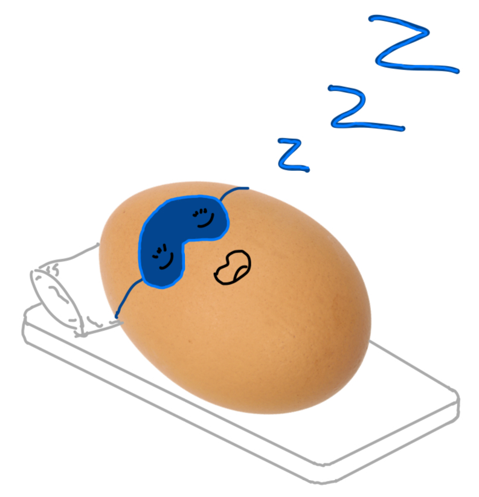

<h1>Project Overview</h1>

<p> Sleep efficiency is influenced by various environmental factors such as temperature, humidity, air pollution, noise levels, and light exposure. By integrating real-time sensor data with historical sleep records, we can uncover patterns that reveal how these external conditions impact sleep duration, efficiency, and disturbances.</p>
<h2>Primary Data Source</h2>
<p> Temperature & Humidity sensor (KY-015), Heartbeat sensor (KY-039)</p>
<h2>Secondary Data Source</h2>

[Sleep Dataset from Kaggle](https://www.kaggle.com/datasets/equilibriumm/sleep-efficiency)<p> and another </p>[Sleep Environment Dataset from Kaggle](https://www.kaggle.com/datasets/karthikiye/wearable-tech-sleep-quality/data)
</p>
<h2>API to be Provided to Users</h2>
<ul>
  <li>Real-time Sleep Data: Retrieve the latest sleep duration and efficiency metrics.
  Historical Sleep Trends</li>
  <li>Access sleep duration, efficiency, and disturbances over time.
  Environmental Impact on Sleep</li>
  <li>Correlate sleep efficiency with temperature, humidity, air pollution, and noise levels.</li>
  <li>Predict sleep efficiency</li>
</ul>

</ul>
<h2>Sensor Modules: </h2>
<ul>
<li>
Heartbeat sensor	KY-039 x2
</li>
<li>
Temperature and humidity sensor	KY-015 x2
</li>


</ul>
<h2>Prediction</h2>
<ul>
<li>
Sleep prediction efficiency: the efficiency of the next sleep cycle based on the current environment 
</li>
</ul>

<br>

# Installation
## Install `python` v3.13
[Download python here](https://www.python.org/downloads/)
## Download
1. Open terminal
2. Clone this repository
```cmd
git clone https://github.com/EggADayKeepTheTeacherAway/SleepQualityPrediction.git
```
3. Change directory into the project's root
```cmd
cd SleepQualityPrediction
```

## Backend
### Change directory to `backend`
```cmd
cd backend
```
### Python set up
1. Creating python virtual environment
  ```cmd
  python3 -m venv venv
  ```
2. Activate your virtual environment
  - Window
  ```cmd
  venv\Scripts\activate
  ```
  - macOS/linux
  ```cmd
  source venv/bin/activate
  ```
3. Install required packages
  ```cmd
  pip install -r requirements.txt
  ```
4. Set up your own config file based on __config.py.example__

### Starting API server
- Start app.py
```cmd
uvicorn controller:app --port 8080 --reload
```

## Frontend
### Make sure you are at root directory
 You should be at `SleepEfficiencyPrediction` directory
 - If you are at `backend` directory, go back a level.
 ```cmd
 cd ..
 ```
### Change directory to `frontend`
```cmd
cd frontend
```

### Run streamlit
```cmd
stream run app.py
```


## Member
- Rattanan Runguthai 6610545481
- Riccardo Mario Bonato 6610545502
